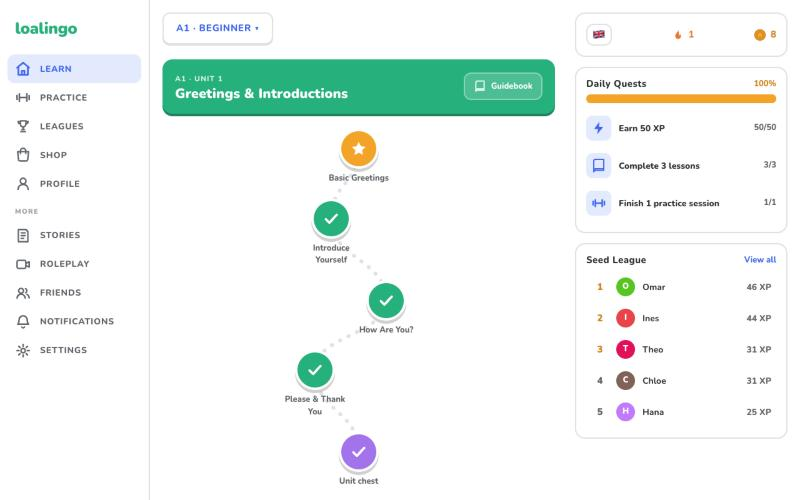
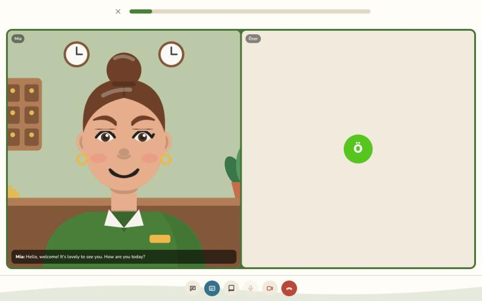
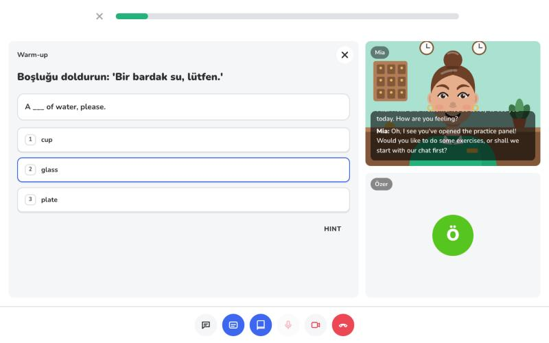
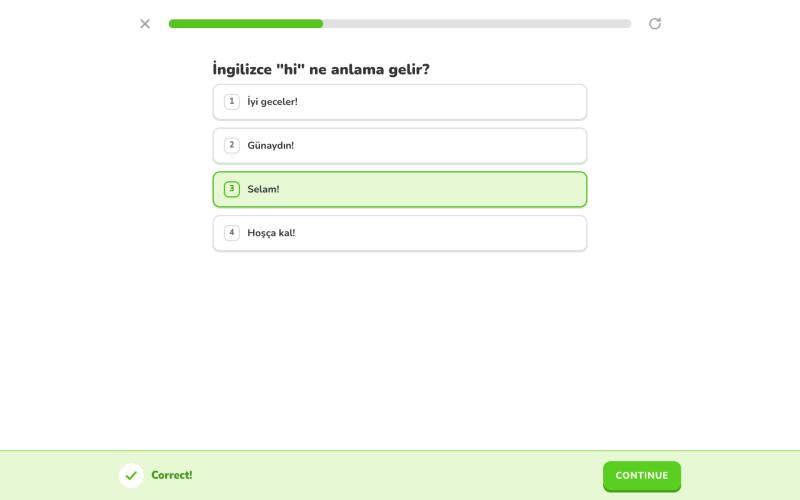
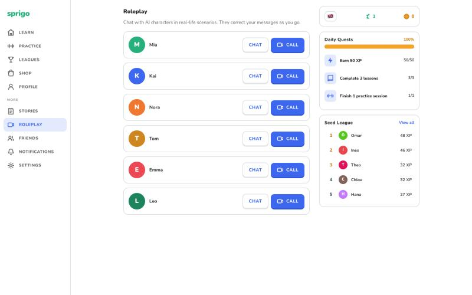
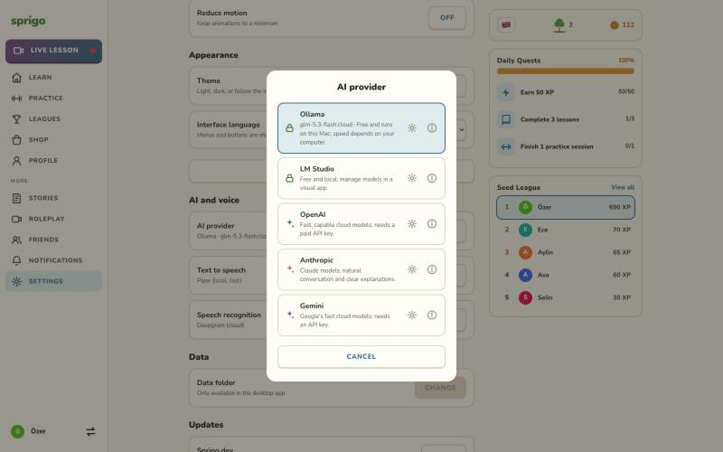
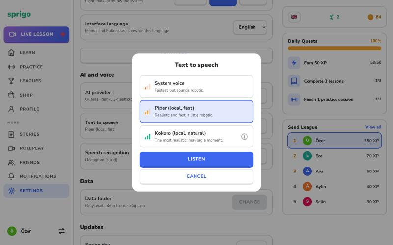
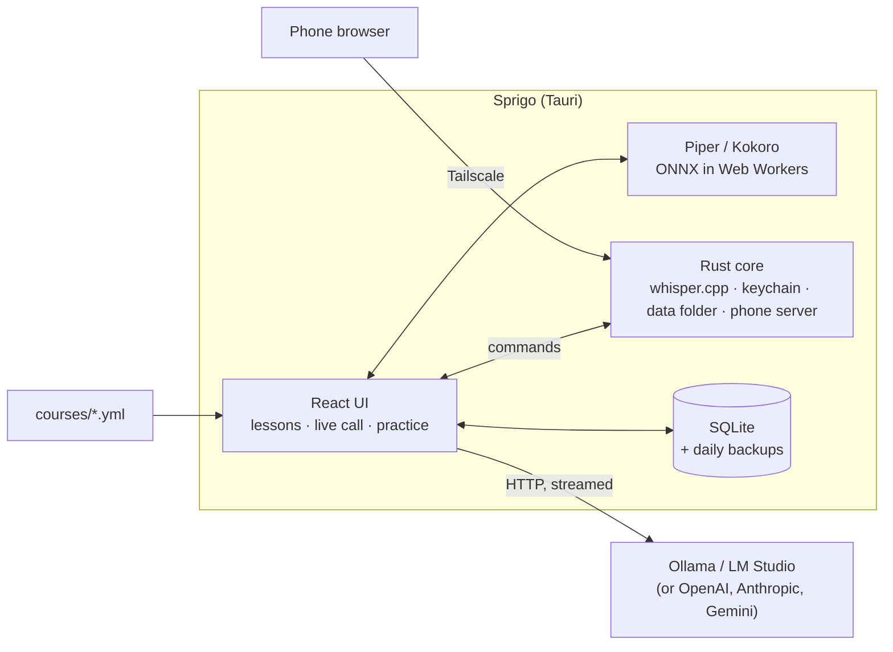

<p align="center"></p>

<h1 align="center">Sprigo</h1>

<p align="center"><b>A free, open-source Duolingo alternative that runs on your own computer.</b><br>Lessons, stories and live conversation practice with an AI tutor, generated by a local model (Ollama or LM Studio). No account, no subscription, your data never leaves your machine.</p>

<p align="center"><a href="https://github.com/ozerozdas/sprigo/releases/latest"><b>Download for macOS, Windows and Linux</b></a></p>

<p align="center"><a href="https://www.opensourcealternatives.to"></a></p>



| Live lesson | Practice together |
| --- | --- |
|  |  |

| Lessons | Roleplay chat |
| --- | --- |
|  |  |

| AI provider | Text to speech |
| --- | --- |
|  |  |

## Features

- **Structured courses:** English A1 → C2, plus Spanish, French, German and Turkish at A1. 50+ steps per level, a harvest basket at the end of each unit and a checkpoint at the end of each level. Each unit has a guidebook in your own language, and a unit or level test lets you skip ahead.
- **AI-generated lessons:** translate, fill in the blank, match, listen, word bank, error correction and more. Lessons adapt to your recent mistakes, and a harder Mastery version turns a finished lesson gold.
- **Live lesson:** a video-call style lesson with one of six animated tutors who talks with you, with live captions. You can cut in while the tutor is speaking. Open the practice panel to do exercises together while the tutor follows along.
- **Sprigo gets to know you:** after a conversation it keeps a few facts about you (interests, goals, what you find hard) and uses them in later lessons. You can see, edit or forget them, or turn memory off.
- **Speaking coach:** live lessons measure how you speak (response time, pauses, answer length, switching to your own language), the tutor adapts during the call, and your profile shows your progress. No audio is recorded.
- **Speaking:** speech recognition runs inside the app (whisper.cpp), with no extra service to install. Deepgram is an optional cloud alternative, and **Try it** lets you check it with your own voice.
- **Natural voices:** besides the system voice, Piper (fast, local) and Kokoro (most natural, English only) run on your machine and are downloaded on first use.
- **Stories and roleplay:** chat or call characters in real-life scenes, and get corrections as you go.
- **Practice hub:** fix your mistakes, speaking and listening practice, your word list, Match Madness and a timed challenge.
- **Your garden:** a tree that grows with your lessons, stays green while you keep your streak (days of roots) and grows a fruit for every level you pass. Each level has its own landscape, from meadow to summit.
- **Gamification:** XP, coins, drops, daily quests, a shop, friends and a local league.
- **Use it on your phone:** turn on **Settings → Use on your phone** and scan the code to open Sprigo in your phone's browser over [Tailscale](https://tailscale.com). Your data, speech recognition and Ollama stay on the computer.
- **Private by default:** your progress stays in a local SQLite database with daily backups, and API keys are kept in the system keychain. You can move the data folder (for example to a synced folder), or export and import it. Several profiles can share one computer, optionally with a PIN.
- Reminders, light and dark themes, and an interface in English, Turkish, German, French or Spanish.
- Automatic in-app updates.

## Install

macOS, with [Homebrew](https://brew.sh):

```bash
brew install --cask ozerozdas/tap/sprigo
```

macOS or Linux (x86_64), without Homebrew:

```bash
curl -fsSL https://raw.githubusercontent.com/ozerozdas/sprigo/master/install.sh | sh
```

Both install the latest release and handle the macOS quarantine flag for you. Windows installers and the other packages (`.deb`, `.rpm`) are on the [Releases](https://github.com/ozerozdas/sprigo/releases/latest) page.

If you install the `.dmg` by hand: the app is not notarized yet, so macOS blocks it the first time. Remove the quarantine flag once:

```bash
xattr -dr com.apple.quarantine /Applications/Sprigo.app
```

## Set up an AI model

On first launch, Sprigo looks for a local model server:

- **[Ollama](https://ollama.com/download)** (recommended): install and start it. If no model is installed yet, Sprigo offers to download `qwen3:8b` (about 5.2 GB) for you. Smaller models run but write noticeably weaker lessons, so Sprigo warns when you pick one under 8B.
- **[LM Studio](https://lmstudio.ai):** start its local server and load a model.
- **Cloud:** you can also use OpenAI, Anthropic or Gemini with your own API key. Pick one in **Settings → Advanced → AI provider**; each option has a short note on what it is good at.

## Architecture

Sprigo is a [Tauri 2](https://tauri.app) app: a React + TypeScript interface in the system webview, with a small Rust core for the things a webview can't do. Everything runs on the learner's machine. The only network calls are to an AI or speech service the learner picks themselves.



### Voice turn in a live lesson

1. **Listen:** the microphone stays in the webview. A small voice-activity detector ([`audio.ts`](src/audio.ts)) cuts out each utterance (it waits for 800 ms of silence) and hands 16 kHz samples to Rust.
2. **Transcribe:** [whisper.cpp](https://github.com/ggerganov/whisper.cpp) (via `whisper-rs`, using the Metal GPU on macOS) turns speech into text with a bundled 57 MB model. No separate service to install. Deepgram is optional.
3. **Think:** the model is kept warm (`keep_alive`), and the reply is streamed through the [Vercel AI SDK](https://ai-sdk.dev). The tutor answers in JSON, and [`tutor.ts`](src/tutor.ts) reads the spoken text out of the partial JSON while it is still arriving.
4. **Speak:** each finished sentence goes straight to the voice engine, so the first sentence plays while the model is still writing the rest. Piper and Kokoro run as ONNX models in Web Workers and are downloaded on first use.
5. **Barge-in:** while the tutor speaks, the mic keeps listening at a higher threshold. If the learner talks over the tutor, playback stops, the line is marked as interrupted, and the next prompt tells the model what was cut off.

[`latency.ts`](src/latency.ts) times each step of a turn (speech end → transcript → first sentence → first sound). To see it, set `localStorage.latency = "1"`.

### Lessons and content

- **Courses are data:** each course is a YAML file validated with Zod ([`course.ts`](src/course.ts)). It names the steps and activity types; the AI writes the actual exercises. Users can drop their own course files into the app data folder.
- **Generation:** one structured call per lesson step, with a schema-checked JSON reply. If that fails, it falls back to one call per activity. Results are cached in SQLite, so a lesson is generated once. Recent mistakes are fed back into the prompt.
- **Providers:** local servers (Ollama, LM Studio) and cloud APIs share one interface. Requests go through Tauri's HTTP plugin, which avoids CORS issues with local servers.

### Data and privacy

- **Storage:** SQLite (`tauri-plugin-sql`) with versioned migrations, a daily backup and a lock file, so two devices never write to a synced data folder at the same time.
- **Memory and speaking stats:** the facts Sprigo remembers and the per-call speaking measurements are rows in the same SQLite database. Speaking stats are computed from timing and transcripts; no audio is kept.
- **Secrets:** API keys live in the OS keychain (macOS Keychain, Windows Credential Manager, Secret Service), never in the database.
- **Phone companion:** the Rust core runs a small HTTP server on `127.0.0.1` and publishes it to the learner's own devices with `tailscale serve`. The phone gets the same UI. Its SQL is sent back to the desktop webview, so the database keeps a single writer, and speech recognition and Ollama run on the desktop. Only one device holds the data at a time.

### Build and release

Pure logic (activities, course parsing, migrations, the league, timing and more) is written without imports from Vite or Tauri, so `node --test` runs it directly. CI builds macOS (Apple silicon and Intel), Windows and Linux on every tagged release and publishes signed updates for the in-app updater.

Design decisions and their reasons are in [docs/DECISIONS.md](docs/DECISIONS.md).

## Development

Requires Node.js with pnpm, Rust, and the [Tauri prerequisites](https://tauri.app/start/prerequisites/).

```bash
pnpm install
pnpm fetch-model   # downloads the whisper speech model into src-tauri/resources
pnpm tauri dev     # desktop app
pnpm dev           # browser preview (no speech, dev storage in localStorage)
pnpm test
pnpm bench         # tutor reply latency per Ollama model (pnpm bench <model…> for some)
```

Courses are plain YAML files in [`courses/`](courses/en.yml). For the course format, activity types and AI layer, see [docs/ARCHITECTURE.md](docs/ARCHITECTURE.md); for the phone companion, [docs/MOBILE.md](docs/MOBILE.md).

### Releasing

The full branch → test → master → release flow is in [docs/RELEASE.md](docs/RELEASE.md).

Bump the version in `package.json`, `src-tauri/tauri.conf.json` and `src-tauri/Cargo.toml` (then `cargo update -p sprigo --offline` in `src-tauri` for the lock file), commit, then push a tag:

```bash
git tag v0.1.2 && git push origin v0.1.2
```

[GitHub Actions](.github/workflows/release.yml) builds macOS (Apple silicon and Intel), Windows and Linux, and uploads them with a merged `latest.json` to a draft release. Publish the draft when all jobs are green; the in-app updater only sees published releases. The workflow needs the updater signing key in the `TAURI_SIGNING_PRIVATE_KEY` repository secret.

## Contributing

Bug reports and ideas are welcome in [Issues](https://github.com/ozerozdas/sprigo/issues). The easiest way to help is a course: courses are plain YAML files in [`courses/`](courses/) that list units, vocabulary and grammar, and the AI writes the exercises. Extending Spanish, French, German or Turkish beyond A1, or adding a new language, needs no code. See [CONTRIBUTING.md](CONTRIBUTING.md).

## License

[MIT](LICENSE)
