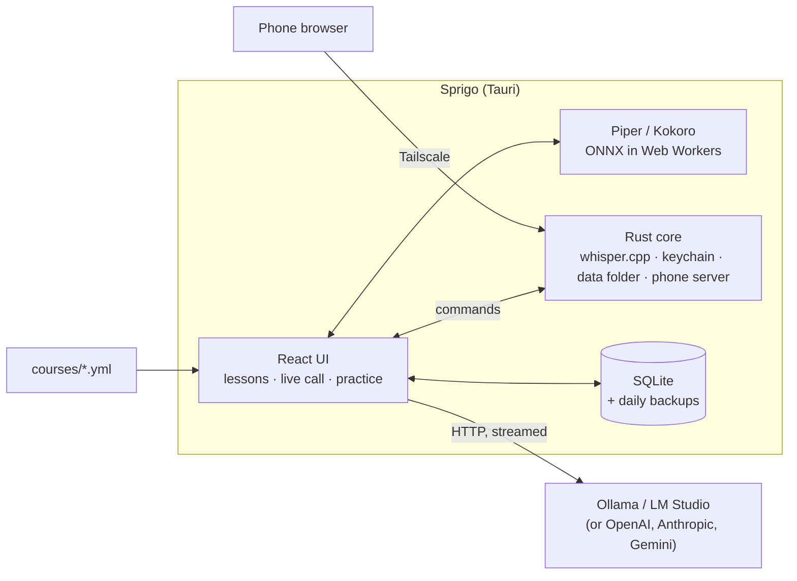

# Sprigo — Architecture notes

The overview, the live-lesson voice turn and the data model come first, then the details behind them: the course contract, the activity types, the AI layer and packaging. Decisions and their reasons: [DECISIONS.md](DECISIONS.md).

## Overview

Sprigo is a [Tauri 2](https://tauri.app) app: a React + TypeScript interface in the system webview, with a small Rust core for the things a webview can't do. Everything runs on the learner's machine. The only network calls are to an AI or speech service the learner picks themselves.



### Voice turn in a live lesson

1. **Listen:** the microphone stays in the webview. A small voice-activity detector ([`audio.ts`](../src/audio.ts)) cuts out each utterance (it waits for 800 ms of silence) and hands 16 kHz samples to Rust.
2. **Transcribe:** [whisper.cpp](https://github.com/ggerganov/whisper.cpp) (via `whisper-rs`, using the Metal GPU on macOS) turns speech into text with a bundled 57 MB model. No separate service to install. Deepgram is optional.
3. **Think:** the model is kept warm (`keep_alive`), and the reply is streamed through the [Vercel AI SDK](https://ai-sdk.dev). The tutor answers in JSON, and [`tutor.ts`](../src/tutor.ts) reads the spoken text out of the partial JSON while it is still arriving.
4. **Speak:** each finished sentence goes straight to the voice engine, so the first sentence plays while the model is still writing the rest. Piper and Kokoro run as ONNX models in Web Workers and are downloaded on first use.
5. **Barge-in:** while the tutor speaks, the mic keeps listening at a higher threshold. If the learner talks over the tutor, playback stops, the line is marked as interrupted, and the next prompt tells the model what was cut off.

[`latency.ts`](../src/latency.ts) times each step of a turn (speech end → transcript → first sentence → first sound). To see it, set `localStorage.latency = "1"`.

### Lessons and content

- **Courses are data:** each course is a YAML file validated with Zod ([`course.ts`](../src/course.ts)). It names the steps and activity types; the AI writes the actual exercises. Users can drop their own course files into the app data folder.
- **Generation:** one structured call per lesson step, with a schema-checked JSON reply. If that fails, it falls back to one call per activity. Results are cached in SQLite, so a lesson is generated once. Recent mistakes are fed back into the prompt.
- **Providers:** local servers (Ollama, LM Studio) and cloud APIs share one interface. Requests go through Tauri's HTTP plugin, which avoids CORS issues with local servers.

### Data and privacy

- **Storage:** SQLite (`tauri-plugin-sql`) with versioned migrations, a daily backup and a lock file, so two devices never write to a synced data folder at the same time.
- **Memory and speaking stats:** the facts Sprigo remembers and the per-call speaking measurements are rows in the same SQLite database. Speaking stats are computed from timing and transcripts; no audio is kept.
- **Secrets:** API keys live in the OS keychain (macOS Keychain, Windows Credential Manager, Secret Service), never in the database.
- **Phone companion:** the Rust core runs a small HTTP server on `127.0.0.1` and publishes it to the learner's own devices with `tailscale serve`. The phone gets the same UI. Its SQL is sent back to the desktop webview, so the database keeps a single writer, and speech recognition and Ollama run on the desktop. Only one device holds the data at a time.

### Build and release

Pure logic (activities, course parsing, migrations, the league, timing and more) is written without imports from Vite or Tauri, so `node --test` runs it directly. CI builds macOS (Apple silicon and Intel), Windows and Linux on every tagged release and publishes signed updates for the in-app updater.

Design decisions and their reasons are in [docs/DECISIONS.md](DECISIONS.md).

## 1. Flow

```
courses/*.yml ──► Course loader (yaml + zod) ──► Course tree (CEFR → unit → step)
                                                     │
                                          Learn screen (path)
                                                     │ tap
                                                     ▼
            Lesson planner: the step's activities (+ vocabulary, grammar, level)
                                                     │
            Activity registry: type → { zod schema, prompt instructions, React view }
                                                     │
            AI provider (selected) ── structured call ──► validate ─► cache (SQLite) ─► render
                                                     │
            Answers ─► progress / XP / mistakes table ─► practice modes
```

## 2. Course YAML contract

Hierarchy: `levels.{A1..C2}.units[].steps[].activities[]` + `levels.X.checkpoint`. Schema: [`src/course.ts`](../src/course.ts).
UI mapping: **section = CEFR level**, **unit** = coloured header card, **path node = step**, **unit chest / checkpoint = end of a unit / level**.

Rules:
- An activity carries only a `type` (+ optional `count` and hints such as `scenario` or `goal`). **The AI writes all the content** from the step's `title`, `description`, `vocabulary`, `grammar` and the level (DECISIONS B5).
- So no lesson opens without an AI provider; first launch runs a setup flow (DECISIONS C6).
- `count`: how many questions to generate for that activity (default 1–3).
- The file defines the target language; the learner's native language comes from settings, and translations are generated for it.
- User courses: `<app data>/courses/*.yml` (macOS: `~/Library/Application Support/com.ozerozdas.sprigo/courses`). A file with the same `iso` overrides the bundled one. A broken file is shown on the Learn screen with its path and the reason.

## 3. Activity types

Some are **question types**, some are **practice modes** built from question types.

| id | Activity | View |
|---|---|---|
| `learn` | Teach a new word or phrase | card |
| `translate` | Translate (free text, normalized or AI check) | input |
| `word_select` | Pick the word | choice |
| `match` | Match pairs | match |
| `word_bank` | Build the sentence from a word bank | bank |
| `fill_blank` | Fill in the blank | choice / input |
| `multiple_choice` | Multiple choice | choice |
| `listen_type` | Listen and type | TTS + input |
| `listen_select` | Listen and pick | choice + listen |
| `image_select` | Picture → word (pictures are emoji) | choice grid |
| `sentence_complete` | Complete the sentence | choice |
| `error_correct` | Correct the mistake | choice / input |
| `dialogue` | Character dialogue | choice + bubbles |
| `speak` | Say it aloud (whisper.cpp) | speak |
| `story` | Short story with comprehension questions | story |
| `roleplay` | Chat with a character | chat |
| `video_call` | Voice call with a character | call |

**Practice modes** (Practice screen; combinations of the above, not new types): listening, speaking, my words, fix your mistakes, Match Madness (`match` against the clock), timed challenge (mixed, against the clock) and Legendary (a finished step replayed one CEFR level harder).

Learning loop: teach = `learn` → recognise = `word_select` / `image_select` → recall = `match` → produce = `word_bank` / `translate` → listen = `listen_*` → speak = `speak` → mistakes → `mistakes` review.

## 4. AI layer

- One zod schema per type, structured output. Invalid output → one retry → a "couldn't generate, try again" state.
- Prompt = system (teacher role, CEFR level, native and target language) + step context + type schema + recent mistakes (the course's last 8, "reuse in 1–2 exercises when it fits") + what Sprigo remembers about the learner.
- A lesson is generated in one call for the whole activity list (faster, more consistent). If a small local model fails, it falls back to one call per activity.
- Cache: SQLite, keyed by enrollment × step. Reopening a lesson is instant; ↻ regenerates it. The next lesson is generated in the background.
- The schema is also written into the prompt, and ```` ```json ```` fenced replies are recovered (some Ollama cloud models ignore `response_format`). Thinking is turned off for local models.
- Providers: Ollama (`localhost:11434`), LM Studio (`localhost:1234/v1`), OpenAI, Anthropic, Gemini. Requests go through Tauri's HTTP plugin (no CORS).

## 5. Packaging notes

- `pnpm tauri build` → `src-tauri/target/release/bundle/…`. Most of the size is the bundled whisper model (~57 MB).
- macOS signing is ad hoc (`bundle.macOS.signingIdentity: "-"`), so other Macs need the one-time `xattr` command from the [README](../README.md#install). Distribution without it needs a Developer ID Application certificate and notarization.
- `[profile.release.build-override] strip = false`: with the macOS 27 linker, stripped proc-macro dylibs (sqlx-macros) fail to load. The app binary is still stripped.
- Releases are built in CI ([RELEASE.md](RELEASE.md)). The repo must stay public: the updater downloads without signing in.
- Updater signing key: kept outside the repo; `TAURI_SIGNING_PRIVATE_KEY` in CI. If it is lost, installed apps will not accept new versions, so keep a backup. Since `createUpdaterArtifacts` is on, every local `tauri build` needs it too.
- The updater moves the download from the system temp folder next to the app. If the app runs from another disk (e.g. `/Volumes/...`) it fails with "Cross-device link"; `/Applications` is fine.
- `tauri-plugin-http` is pinned to `~2.7` on the Rust side to match the npm package; a mismatch stops `tauri build`.
